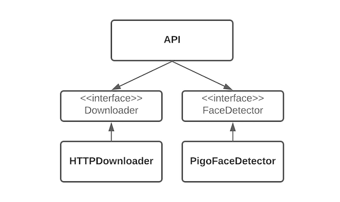

# Writing a Face Detection API in Go

Let's write a Face Detection API in Go. Interface should be simple, an HTTP API that accepts an image URL. Output should
be a list of detected faces, including the face boundaries and positions of eyes and mouth.

Our objective is to create a production ready service in a short time frame.

A minimal set of components we need to accomplish this boils down to:

- **Face Detector** - a wrapper around the face detection library.
- **Downloader** that downloads an image from a URL and makes sure we don't download files that are too big.
- **HTTP API** that receives the requests, validates input, calls Downloader and Face Detector, and finally sends back the results.

In this setup, HTTP API depends on Face Detector and Downloader. At one point in the future we might decide the face detection library we picked does not satisfy our use case. 
Downloader requirements may change as well. We might want to support FTP or SMB endpoints. For this reason we'll introduce _FaceDetector_ and _Downloader_ interfaces in between.



To be as efficient as possible, we're going to write each component, test it independently and then integrate all the components.
 
## Setting up the project

Adding the [golangci-lint](https://github.com/golangci/golangci-lint) is the first thing I do on a new project. Here are my usual settings:
```
golangci-lint run -E golint -E gofmt -E govet -E goimports -E gocyclo -E gocognit -E ineffassign -E misspell
```
I like to create a Makefile entry so that I can easily run it with `make lint`. I'd highly suggest that you set up a trigger that runs _golangci-lint_ on file save, if you're IDE/Editor supports it. 

Our service components are going to live in `pkg` folder. One package per component. Interfaces get their own package to keep the dependencies as lean as possible.
```
├── pkg
│  ├── api
│  │  └── api.go
│  ├── download
│  │  ├── download.go
│  │  └── httpdownloader
│  │     └── http_download.go
│  ├── facedetect
│  │  ├── face_detect.go
│  │  └── pigofacedetect
│  │     └── pigo_face_detect.go
``` 

`pkg/download/download.go` and `facedetect/face_detect.go` are the interfaces, and the implementations are in the directories one level bellow.

## Face detector

First we need to find a good face detection library. Quick google search reveals multiple options, but
[pigo](https://github.com/esimov/pigo) stands out as it's a pure Go implementation, and doesn't require any 3rd party libraries.
It detects facial features we need and detection quality is decent enough for this exercise. 
The downside is that it requires a lot of files to work. If you need a standalone binary make sure you check out the Gotcha section later in this post. 

The interface for the face detector can be as simple as:
```go	
type FaceDetector interface {
    DetectFaces(ctx context.Context, img io.Reader) ([]Face, error)
}
```

Context is always nice to have, we'll include it for future use. 
For receiving images `io.Reader` will do. This way we can pass the HTTP response body from downloader to face detector directly without having to buffer the image first.

For the response, we can use the following structs:
```go
type Bounds struct {
	X      int `json:"x"`
	Y      int `json:"y"`
	Height int `json:"height"`
	Width  int `json:"width"`
}

type Point struct {
	X int `json:"x"`
	Y int `json:"y"`
}

type Face struct {
	Bounds   *Bounds `json:"bounds"`
	Mouth    *Point  `json:"mouth,omitempty"`
	RightEye *Point  `json:"right_eye,omitempty"`
	LeftEye  *Point  `json:"left_eye,omitempty"`
}
```

To speed things up, we're going to copy the content of [pigo cli](https://github.com/esimov/pigo/blob/master/cmd/pigo/main.go) into our implementation and modify the code a bit to adhere `FaceDetector` interface.
We also need to copy cascade files required by _pigo_. 

Keep in mind that _pigo_ relies on `image` package. To enable the JPEG and PNG support you should add the following imports:
```go
import (
	_ "image/jpeg" // Add JPEG support.
	_ "image/png"  // Add PNG support.
)
``` 

At this point we can write some tests for face detector to make sure the results are good before proceeding. 
You can use image editor of your choice to verify that face boundaries and facial features returned by your implementation match the input image. 

## Image downloader

Downloader initiates the HTTP GET request and checks that file is not too big. It returns response body as `io.ReadCloser`. 

```go
type Downloader interface {
	Download(ctx context.Context, url string) (io.ReadCloser, error)
}
```

With this design, HTTP API can forward the stream to the face detector and close it afterwards. 

```go
rc, _ := Download(ctx, url) // error check omitted for simplicity
defer func() { _ = rc.Close() }()
DetectFaces(ctx, rc)
```

Outbound requests should be time bound to prevent resource leakage. One way to achieve this is by using ```NewRequestWithContext```.

```go	
ctx, cancel := context.WithTimeout(ctx, timeout)
_ = cancel
   
req, _ := http.NewRequestWithContext(ctx, http.MethodGet, url, nil)
_, _ := client.Do(req)
```

Having a downloader interface allows us to do cool things, like wrapping our implementation in another one. 
Following example demonstrates how you could add the bandwidth limiting:

```go
type ShapedDownloader struct {
	d    download.Downloader
	rate int64
}

func NewShapedDownloader(d download.Downloader, rate int64) *ShapedDownloader {
	return &ShapedDownloader{d: d, rate: rate}
}

func (s *ShapedDownloader) Download(ctx context.Context, url string) (io.ReadCloser, error) {
	rc, err := s.d.Download(ctx, url)
	if err != nil {
		return nil, err
	}

	// Replace ReadCloser with ShapedReadCloser here...
	shapedRc := _
	
	return shapedRc, nil
}
```

Another interesting application of this is validation of an image URL against the exclusion list. This is probably a good
idea if you plan to expose your service to the internet.

Now is a good time to test our Downloader implementation in isolation.

## HTTP API

HTTP API should handle requests, register routes and create an HTTP server. 
```go
func (a *API) handleFaceDetect(w http.ResponseWriter, r *http.Request)
func (a *API) Routes() http.Handler
func (a *API) Serve(ctx context.Context, handler http.Handler) error
```

Request handler is the most important part of this package. It should validate user input first and then call downloader 
and face detector. I suggest that you write it and test it first. 

Make sure that handler returns the correct status codes and content types. For example, passing an invalid url or non image url 
should return the status code 400, indicating the user error. On the other hand, error occurred in one of the 
components should return the status code 500. When returning JSON, add the `Content-Type` header to indicate that the 
response contains data of `application/json` MIME type.

Role of `Routes` is to create a router and register our face detection endpoint. It's also a good place to add CORS support if you plan to create a web interface later.
You can use `github.com/gorilla/mux` and `github.com/gorilla/handlers` for routing and CORS handling. 

```go
r := mux.NewRouter()
r.Methods(http.MethodGet).Path("/v1/face-detect").HandlerFunc(a.handleFaceDetect)

allowAllOrigins := handlers.AllowedOriginValidator(func(origin string) bool {
    return true // Allow all origins
})
headersOk := handlers.AllowedHeaders([]string{})
methodsOk := handlers.AllowedMethods([]string{"GET", "HEAD", "OPTIONS"})

return handlers.CORS(headersOk, allowAllOrigins, methodsOk)(r)
```

Another important thing that we have to handle inside the `Routes` method are the handler panics. Go http server spawns
a goroutine per request. This means that every request has to recover from eventual panics. Although `http.Server` recovers
from panics, we could use `handlers.RecoveryHandler` from `gorilla/handlers` with custom logger to log 
the panic and trigger an alarm. 

```go
return handlers.RecoveryHandler()(handlers.CORS(headersOk, allowAllOrigins, methodsOk)(r))
```

Finally, `Serve` creates an HTTP server. We could do this outside of api package, but will keep it here for simplicity.

To make our service production ready, we need to set up some timeouts for the web server. 
I suggest that you read "[The complete guide to Go net/http timeouts](https://blog.cloudflare.com/the-complete-guide-to-golang-net-http-timeouts)" 
and "[So you want to expose Go on the Internet](https://blog.cloudflare.com/exposing-go-on-the-internet/)" articles on CloudFlare blog. Having
a load balancer in front of your service will prevent clients from keeping the connections open, but you should set timeouts on your service as well.
Reducing the maximum size of request headers is also a good idea. Default value is 1 MiB. For our service, 1 KiB will do.

Go http server creates a new context for each request. By default, it uses `context.Background` as a parent context. We want to override this as well,
so the caller can set the parent context. This way we can gracefully stop all requests when parent receives an interrupt signal.

```go
srv := http.Server{
    Addr:              a.addr,
    ReadTimeout:       time.Second * 2,
    ReadHeaderTimeout: time.Second * 2,
    WriteTimeout:      time.Second * 5,
    IdleTimeout:       time.Second * 5,
    MaxHeaderBytes:    1024,
    BaseContext: func(listener net.Listener) context.Context {
        return ctx
    },
    Handler: handler,
}
```

Note that `Serve` could call `Routes` directly, but we'll leave it to the caller. This way we can easily introduce middleware later.
For example, caller could add rate limiter, cache or access log middleware without modifying the HTTP API component. It's also easier to test.

```go
a.Serve(ctx, middleware(a.Routes()))
```

Mentioning the tests, it's time to introduce our first integration test. Use `httptest.NewServer` to create a test server. It expects 
 `http.Handler` as a parameter. Pass the return of `Routes`.
Test server exposes the URL field. Use it as a base URL for your test requests.

```go
url := fmt.Sprintf("%s/v1/face-detect?image_url=%s", testSrv.URL, imgURL)
```

## Putting it all together

Now is the time to create a main function. We can put it in `cmd/facedetection/facedetection.go`.

Our goal here is to instantiate our face detector and downloader implementations, and start the api.
The most basic version of main would look like this:

```go
func main() {
    d := httpdownloader.NewHTTPDownloader()
    fd := pigofacedetect.NewPigoFaceDetector()
    _ := a.Serve(ctx, a.Routes())
}
```
> Constructor params may vary depending on your implementations.

Now imagine that we want to introduce a cache middleware that writes the state to disk. Stopping the service could potentially cause data corruption.
To prevent this, we could give a heads up to our components by catching the interrupt signal and terminating the parent context. 
Parent context cancellation will propagate to child contexts, signaling the components to do the cleanup.

```go
// Create a parent context.
ctx := context.Background() 
ctx, cancel := context.WithCancel(ctx)


// Create a channel that will receive SIGINT and SIGTERM.
sigc := make(chan os.Signal, 1) 
signal.Notify(sigc, syscall.SIGINT, syscall.SIGTERM)


// Create a goroutine that will cancel the parent context when signal is received.
go func() { 
    select {
    case <-sigc:
        cancel()
    case <-ctx.Done():
    }
}()

// Run your application here.
if err := run(ctx, os.Args); err != nil { 
    os.Exit(1)
}

// Give components some time to do the cleanup before exiting. 
// This as well might be interupted by another signal.
select {
case <-sigc:
case <-time.After(time.Second):
}
```

## Caching the responses

Now we have a fully working Face Detection API. To improve efficiency, we can cache the successful responses.
Ideally, we don't want to change any of the existing components. That's why we're going to introduce the cache 
in the caller (main) as an HTTP middleware.

Middleware is a function that receives the original `http.Handler` and returns an `http.Handler` which wraps the original one. This gives
us opportunity to access the request and response writer before and after the original handler.
 
```go
func Middleware() func(handler http.Handler) http.Handler {
	return func(handler http.Handler) http.Handler {
		return http.HandlerFunc(func(w http.ResponseWriter, r *http.Request) {
           // Before the original handler.
           handler.ServeHTTP(rr, r)
           // After the original handler.
		})
	}
}
```
> Example above adds another wrapper that returns the middleware function. This way we can pass arguments to the middleware.

Our simple HTTP cache implementation will look like this. First, we try to serve the saved response.
In the case of cache miss, we'll run the original handler and record the response. To achieve this, we need an HTTP response recorder.

`http.ResponseWriter` is an interface that defines `Header`, `WriteHeader` and `Write` methods. `Header` returns the response header that's going
to be written by `WriteHeader`. `Write` is used to send the response body. To record the response, each method in our implementation should pass calls
to the original `http.ResponseWriter` while recording the parts of the response. `WriteHeader` is going to save a response header and a status code.
`Write` is going to save a response body to a buffer.

To keep things simple, our cache won't adhere to the [RFC7234](https://tools.ietf.org/html/rfc7234). Cached items won't expire and we
won't consider the cache headers. We also won't limit the maximum size of the cache.

After recording the response, we want to persist it to a store that allows querying as well. We also want to make these stores pluggable.
Let's introduce another interface for the store.

```go
type Response struct {
	StatusCode int
	Header     http.Header
	Body       []byte
}

type CacheStore interface {
	Save(key string, response *Response) error
	Load(key string) (*Response, error)
}
```

You can start with simple in-memory hash map based implementation. Later, if you want to scale out your service you can
replace this implementation with one backed by redis or something similar. Nice thing about using redis is that you get TTL out of box.

## Gotchas 

- Make sure you ship the cascades directory with the binary as _pigo_ relies on these. My implementation, by default,
 tries to find the path automatically. You can override it using the `-c` flag. Embedding 
 the cascades into a binary with [packr](https://github.com/gobuffalo/packr) is also an option.
- Detection will not work on images where people lean to the side because _pigo_ detects only faces that are perpendicular to the ground (X axis). 
You could tweak the angle settings if you need to perform detection on images shot at other angles.   
- _pigo_ sometimes makes two detections on the same face. Overlap detection and removal would be nice to have at one point.
- Keep in mind that my implementation of the API omits the facial features it's unable to detect.
 
## Wrapping Up

This post covers basic requirements for a Go image analysis service running in production. It mainly focuses on design, stability and resilience.
However, there's a lot of room for improvement. Next step would be instrumenting your application.
This includes logging events, requests and errors, and collecting metrics. 
Provided insights will help you operate the service confidently and reliably. 

You can browse my implementation [here](https://github.com/bokan/facedetection). Web UI for testing is available [here](https://facedetect.bokan.io/).

